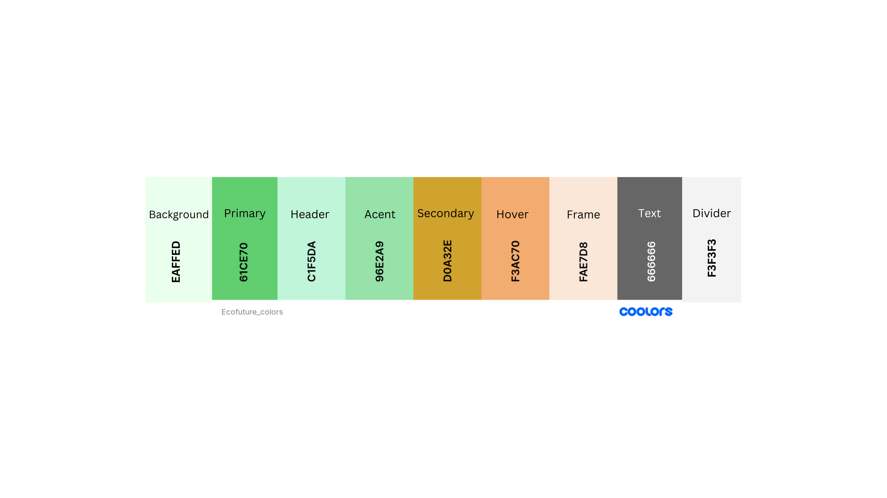

### EcoFuture
https://www.ecofuture.com.ua/

Here is stored all the files, images, font types and color schema that are used in EcoFuture WebSite

#### Logo 
needs an updata  

___
Color Schema:

For translate the pages there are two installed plugins:

1. GTranslate - nice looking supports as many languages as possible - but only Google Translates, you can not edit translations.
2. TranslatePress - only two languages in the free version, but you can edit translations (actually in en to ua case you need manually type all the translations)
---
#### Need to be done 
- add proper slider/carousel
- add products photos
- add products descriptions
- fix and polish
- translate to ua
- redirect 'About Us page'
- footer menu list
- price list in pdf + English version

#### Done
- Move everything to the front page (one-page website)
- Redirect Products/ contact us to the proper parts of the page
- main layout/design
- colors, buttons etc.